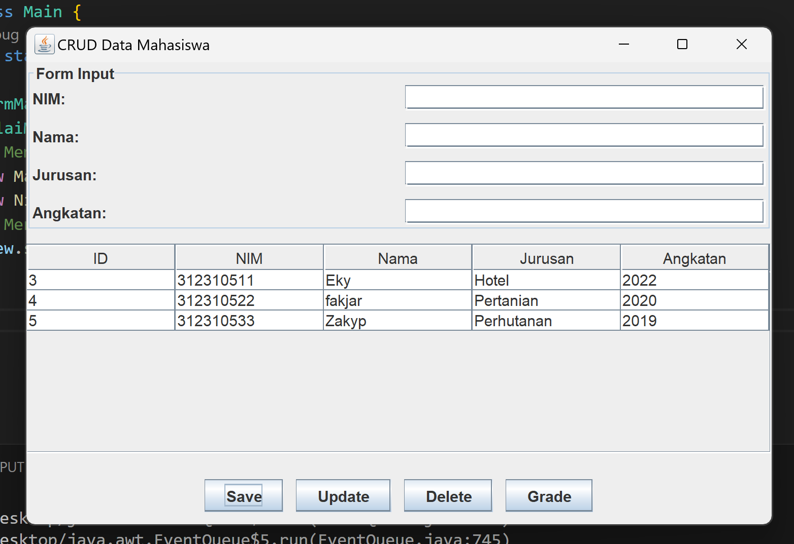

<h1>Praktikum Uas</h1>

| Keterangan | Data Diri                |
| ---------- | ------------------- |
| **Nama**   | Romi Rahman         |
| **NIM**    | 312310581           |
| **Kelas**  | TI.23.A6            |

## Link Youtube
Video berisi penjelasan proses pembuatan program CRUD Mahasiswa


## Project OOP berbasis MVC
### Requirements :
- Text Editor
- Library mysql-connector
- Mysql
- XAMPP

### Code :
#### Buat database :
```sql
mysql -u root

create database akademik;

use akademik;

CREATE TABLE mahasiswa (
  id INT(11) NOT NULL AUTO_INCREMENT PRIMARY KEY,
  nama VARCHAR(100) DEFAULT NULL,
  nim VARCHAR(50) DEFAULT NULL,
  jurusan VARCHAR(100) DEFAULT NULL,
  angkatan INT(11) DEFAULT NULL
);

CREATE TABLE nilai (
  id INT(11) NOT NULL AUTO_INCREMENT PRIMARY KEY,
  mahasiswa_id INT(11) NOT NULL,
  mata_kuliah VARCHAR(100) NOT NULL,
  semester INT(11) NOT NULL,
  nilai DOUBLE NOT NULL,
  KEY mahasiswa_id (mahasiswa_id),
  FOREIGN KEY (mahasiswa_id) REFERENCES mahasiswa (id)
);
```
#### Tambah package classes yang berisi :

Class Database :
```java
package classes;

import java.sql.*;
import java.util.List;
import java.util.stream.Collectors;

public abstract class BaseModel<T> {
    protected final Database database;
    protected final String tableName;
    protected final List<String> fields;

    public BaseModel(String tableName, List<String> fields) {
        this.database = new Database();
        this.tableName = tableName;
        this.fields = fields;
    }

    public T find(int id) {
        String query = "SELECT * FROM " + tableName + " WHERE id = ?";
        List<T> results = database.read(query, this::mapRow, id);
        return results.isEmpty() ? null : results.get(0);
    }

    public List<T> find() {
        String query = "SELECT * FROM " + tableName;
        return database.read(query, this::mapRow);
    }

    public boolean save(T object) {
        if (isNewRecord(object)) {
            return insert(object);
        } else {
            return update(object);
        }
    }

    protected boolean insert(T object) {
        List<String> fieldsWithoutId = fields.stream()
                .filter(field -> !field.equalsIgnoreCase("id"))
                .collect(Collectors.toList());

        String fieldNames = String.join(", ", fieldsWithoutId);
        String placeholders = String.join(", ", fieldsWithoutId.stream().map(f -> "?").toArray(String[]::new));
        String query = "INSERT INTO " + tableName + " (" + fieldNames + ") VALUES (" + placeholders + ")";
        return database.executeUpdate(query, getValues(object, false)) > 0;
    }

    protected boolean update(T object) {
        List<String> fieldsWithoutId = fields.stream()
                .filter(field -> !field.equalsIgnoreCase("id"))
                .collect(Collectors.toList());

        String setClause = String.join(", ", fieldsWithoutId.stream().map(f -> f + " = ?").toArray(String[]::new));
        String query = "UPDATE " + tableName + " SET " + setClause + " WHERE id = ?";
        return database.executeUpdate(query, getValues(object, true)) > 0;
    }

    public boolean delete(int id) {
        String query = "DELETE FROM " + tableName + " WHERE id = ?";
        return database.executeUpdate(query, id) > 0;
    }

    protected abstract boolean isNewRecord(T object);

    protected abstract T mapRow(ResultSet rs) throws SQLException;

    protected abstract Object[] getValues(T object, boolean includeId);

    public void close() {
        database.close();
    }
}
package classes;

import java.io.FileInputStream;
import java.io.IOException;
import java.sql.*;
import java.util.ArrayList;
import java.util.List;
import java.util.Properties;

public class Database {
    private Connection conn;

    public Database() {
        try {
            // Memuat driver MySQL
            Class.forName("com.mysql.cj.jdbc.Driver");
            System.out.println("MySQL Driver loaded successfully.");

            // Membaca file konfigurasi
            Properties properties = new Properties();
            properties.load(new FileInputStream("resources/config.properties"));

            // Ambil parameter koneksi
            String url = properties.getProperty("db.url");
            String user = properties.getProperty("db.user");
            String password = properties.getProperty("db.password", ""); // Gunakan string kosong jika password tidak ada

            System.out.println("Connecting to database: " + url);

            // Membuka koneksi
            conn = DriverManager.getConnection(url, user, password);
            System.out.println("Connection established successfully!");

        } catch (ClassNotFoundException e) {
            System.err.println("MySQL Driver not found!");
            e.printStackTrace();
            throw new RuntimeException("Driver MySQL tidak ditemukan.", e);
        } catch (SQLException e) {
            System.err.println("Failed to connect to the database.");
            e.printStackTrace();
            throw new RuntimeException("Gagal terhubung ke database.", e);
        } catch (IOException e) {
            System.err.println("Configuration file not found or invalid.");
            e.printStackTrace();
            throw new RuntimeException("File konfigurasi tidak ditemukan atau tidak valid.", e);
        }
    }

    public Connection getConn() {
        return conn;
    }

    /**
     * Execute Query SELECT
     */
    public ResultSet query(String query, Object... params) {
        try {
            PreparedStatement stmt = conn.prepareStatement(query);
            setParameters(stmt, params);
            return stmt.executeQuery();
        } catch (SQLException e) {
            e.printStackTrace();
            return null;
        }
    }

    /**
     * Execute an update query (INSERT, UPDATE, DELETE)
     */
    public int executeUpdate(String query, Object... params) {
        try {
            PreparedStatement stmt = conn.prepareStatement(query);
            setParameters(stmt, params);
            return stmt.executeUpdate();
        } catch (SQLException e) {
            e.printStackTrace();
            return 0;
        }
    }

    /**
     * General method to read data into a list
     *
     * @param <T>       The type of object to be returned
     * @param sql       The SELECT query
     * @param rowMapper A functional interface to map a ResultSet row into an object
     * @param params    The query parameters
     * @return A list of mapped objects
     */
    public <T> List<T> read(String sql, RowMapper<T> rowMapper, Object... params) {
        List<T> result = new ArrayList<>();
        try (ResultSet rs = query(sql, params)) {
            while (rs != null && rs.next()) {
                result.add(rowMapper.mapRow(rs));
            }
        } catch (SQLException e) {
            e.printStackTrace();
        }
        return result;
    }

    private void setParameters(PreparedStatement stmt, Object[] params) throws SQLException {
        for (int i = 0; i < params.length; i++) {
            stmt.setObject(i + 1, params[i]);
        }
    }

    public void close() {
        try {
            if (conn != null && !conn.isClosed()) {
                conn.close();
            }
        } catch (SQLException e) {
            e.printStackTrace();
        }
    }
}
package classes; 
 
import java.sql.ResultSet; 
import java.sql.SQLException; 
 
public interface RowMapper<T> { 
    T mapRow(ResultSet rs) throws SQLException; 
} 
```
#### Package Controller :
Class MahasiswaController :
```java
package controller;

import model.Mahasiswa;
import model.MahasiswaModel;
import model.NilaiModel;
import view.FormInputNilai;
import view.FormMahasiswa;

import javax.swing.*;
import javax.swing.table.DefaultTableModel;
import java.util.List;

public class MahasiswaController {
    private MahasiswaModel mahasiswaModel;
    private NilaiModel nilaiModel;  // Tambahkan objek NilaiModel
    private FormMahasiswa view;

    public MahasiswaController(FormMahasiswa view, NilaiModel nilaiModel) {  // Tambahkan NilaiModel ke konstruktor
        this.view = view;
        this.nilaiModel = nilaiModel;  // Inisialisasi NilaiModel
        view.btnSave.addActionListener(e -> saveData());
        view.btnUpdate.addActionListener(e -> updateData());
        view.btnDelete.addActionListener(e -> deleteData());
        view.btnViewNilai.addActionListener(e -> openFormInputNilai());  // Panggil untuk membuka form input nilai
        mahasiswaModel = new MahasiswaModel();
        loadData();
    }

    private void deleteData() {
        int selectedRow = view.tblMahasiswa.getSelectedRow();
        if (selectedRow != -1) {
            int id = Integer.parseInt(view.tblMahasiswa.getModel().getValueAt(selectedRow, 0).toString());
            if (mahasiswaModel.delete(id)) {
                JOptionPane.showMessageDialog(null, "Data berhasil dihapus!");
                loadData();
                clearForm();
            } else {
                JOptionPane.showMessageDialog(null, "Gagal menghapus data!");
            }
        } else {
            JOptionPane.showMessageDialog(null, "Pilih data yang akan dihapus!");
        }
    }

    private void updateData() {
        int selectedRow = view.tblMahasiswa.getSelectedRow();
        if (selectedRow != -1) {
            int id = Integer.parseInt(view.tblMahasiswa.getModel().getValueAt(selectedRow, 0).toString());
            Mahasiswa mhs = mahasiswaModel.find(id);
            view.txtNim.setText(mhs.getNim());
            view.txtNama.setText(mhs.getNama());
            view.txtJurusan.setText(mhs.getJurusan());
            view.txtAngkatan.setText(String.valueOf(mhs.getAngkatan()));
        } else {
            JOptionPane.showMessageDialog(null, "Pilih data yang akan diubah!");
        }
    }

    private void saveData() {
        String nim = view.txtNim.getText();
        String nama = view.txtNama.getText();
        String jurusan = view.txtJurusan.getText();
        int angkatan = Integer.parseInt(view.txtAngkatan.getText());

        Mahasiswa mhs = new Mahasiswa();
        mhs.setNim(nim);
        mhs.setNama(nama);
        mhs.setJurusan(jurusan);
        mhs.setAngkatan(angkatan);

        int selectedRow = view.tblMahasiswa.getSelectedRow();
        if (selectedRow != -1) {
            mhs.setId(Integer.parseInt(view.tblMahasiswa.getModel().getValueAt(selectedRow, 0).toString()));
        }

        if (mahasiswaModel.save(mhs)) {
            loadData();
            clearForm();
            JOptionPane.showMessageDialog(view, "Data berhasil disimpan");
        } else {
            JOptionPane.showMessageDialog(view, "Gagal menyimpan data");
        }
    }

    private void clearForm() {
        view.txtNim.setText("");
        view.txtNama.setText("");
        view.txtJurusan.setText("");
        view.txtAngkatan.setText("");
        view.tblMahasiswa.clearSelection();
    }

    private void loadData() {
        DefaultTableModel tableModel = (DefaultTableModel) view.tblMahasiswa.getModel();
        tableModel.setRowCount(0);
        view.tblMahasiswa.setModel(tableModel);
        List<Mahasiswa> mahasiswaList = mahasiswaModel.find();
        for (Mahasiswa mahasiswa : mahasiswaList) {
            tableModel.addRow(new Object[]{
                    mahasiswa.getId(),
                    mahasiswa.getNim(),
                    mahasiswa.getNama(),
                    mahasiswa.getJurusan(),
                    mahasiswa.getAngkatan()
            });
        }
    }

    private void openFormInputNilai() {
        // Pastikan form input nilai hanya terbuka saat tombol Grade ditekan
        FormInputNilai formInputNilai = new FormInputNilai(nilaiModel);
        formInputNilai.setVisible(true);
    }
}

```
#### Package Model :
Class Mahasiswa :
```java
package model; 
 
public class Mahasiswa { 
    private int id; 
    private String nim; 
    private String nama; 
    private String jurusan; 
    private int angkatan; 
 
    public Mahasiswa() { 
        super(); 
    } 
 
    public Mahasiswa(int id, String nim, String nama, String jurusan, int 
angkatan) { 
        this.id = id; 
        this.nim = nim; 
        this.nama = nama; 
        this.jurusan = jurusan; 
        this.angkatan = angkatan; 
    } 
 
    // getter and setter 
 
    public int getId() { 
        return id; 
    } 
 
    public void setId(int id) { 
        this.id = id; 
    } 
 
    public String getNim() { 
        return nim; 
    } 
 
    public void setNim(String nim) { 
        this.nim = nim; 
    } 
 
    public String getNama() { 
        return nama; 
    } 
 
    public void setNama(String nama) { 
        this.nama = nama; 
    } 
 
    public String getJurusan() { 
        return jurusan; 
    } 
 
    public void setJurusan(String jurusan) { 
        this.jurusan = jurusan; 
    } 
 
    public int getAngkatan() { 
        return angkatan; 
    } 
 
    public void setAngkatan(int angkatan) { 
        this.angkatan = angkatan; 
    } 
}
```
### Package View
Class FormMahasiswa :
```java
package view;

import javax.swing.*;
import javax.swing.table.DefaultTableModel;
import java.awt.*;

public class FormMahasiswa extends JFrame {
    private JPanel formPanel, buttonPanel;
    public JTextField txtNim, txtNama, txtJurusan, txtAngkatan;
    public JButton btnSave, btnUpdate, btnDelete, btnViewNilai;
    public JTable tblMahasiswa;

    public FormMahasiswa() {
        setTitle("CRUD Data Mahasiswa");
        setSize(600, 400);
        setDefaultCloseOperation(EXIT_ON_CLOSE);
        setLocationRelativeTo(null);

        // Panel Form
        formPanel = new JPanel(new GridLayout(4, 2, 10, 10));
        formPanel.setBorder(BorderFactory.createTitledBorder("Form Input"));
        formPanel.add(new JLabel("NIM:"));
        txtNim = new JTextField();
        formPanel.add(txtNim);
        formPanel.add(new JLabel("Nama:"));
        txtNama = new JTextField();
        formPanel.add(txtNama);
        formPanel.add(new JLabel("Jurusan:"));
        txtJurusan = new JTextField();
        formPanel.add(txtJurusan);
        formPanel.add(new JLabel("Angkatan:"));
        txtAngkatan = new JTextField();
        formPanel.add(txtAngkatan);

        // Panel Tombol
        buttonPanel = new JPanel(new FlowLayout(FlowLayout.CENTER, 10, 10));
        btnSave = new JButton("Save");
        btnUpdate = new JButton("Update");
        btnDelete = new JButton("Delete");
        btnViewNilai = new JButton("Grade");
        buttonPanel.add(btnSave);
        buttonPanel.add(btnUpdate);
        buttonPanel.add(btnDelete);
        buttonPanel.add(btnViewNilai);

        // Tabel Mahasiswa
        tblMahasiswa = new JTable();
        DefaultTableModel model = new DefaultTableModel(new String[]{"ID", "NIM", "Nama", "Jurusan", "Angkatan"}, 0);
        tblMahasiswa.setModel(model);

        // Layout
        setLayout(new BorderLayout(10, 10));
        add(formPanel, BorderLayout.NORTH);
        add(new JScrollPane(tblMahasiswa), BorderLayout.CENTER);
        add(buttonPanel, BorderLayout.SOUTH);
    }
}
```
## Tampilan :

